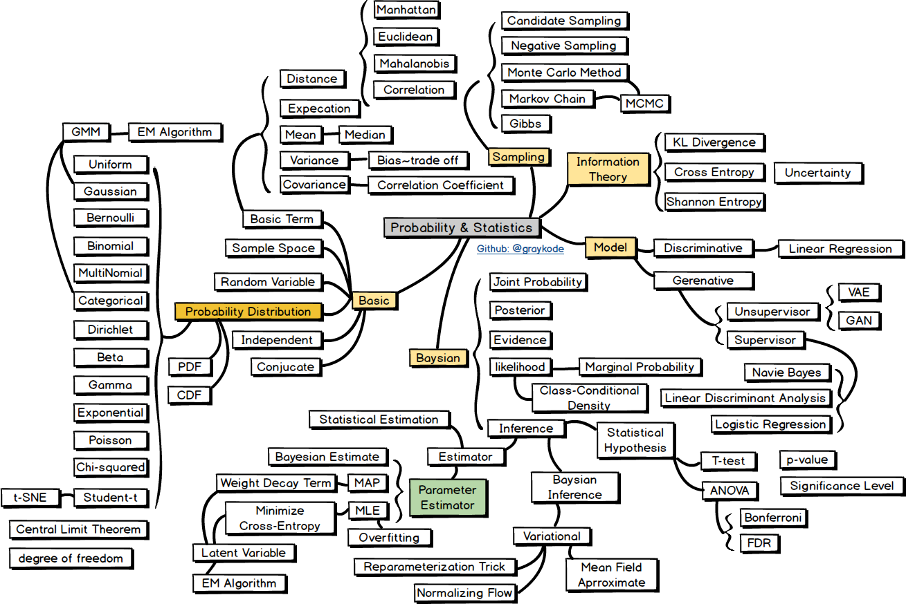
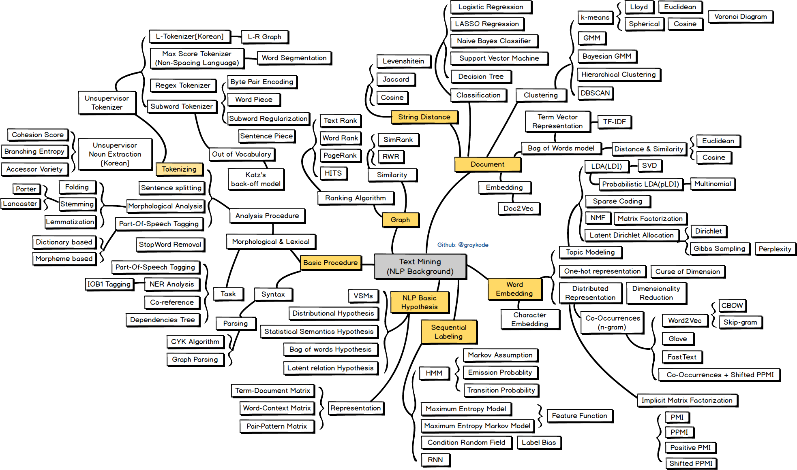
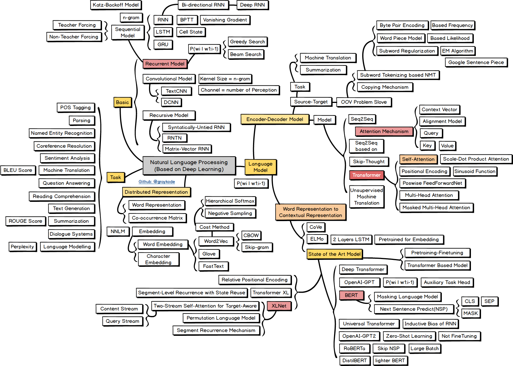

# Data Science Cheat Sheet and NLP Road Map

## Data Science Cheat Sheet
- [BecomingHumanCheatSheets](cheat-sheet/BecomingHumanCheatSheets.pdf)
- [Bokeh](cheat-sheet/bokeh.pdf)
- [Datatable](cheat-sheet/datatable.pdf)
- [Importing Data](cheat-sheet/importing_data.pdf)
- [Jupyter Notebook](cheat-sheet/jupyter_notebook.pdf)
- [Keras](cheat-sheet/keras.pdf)
- [Matplotlib](cheat-sheet/matplotlib.pdf)
- [Numpy](cheat-sheet/numpy.pdf)
- [Pandas 1](cheat-sheet/pandas_1.pdf)
- [Pandas 2](cheat-sheet/pandas_2.pdf)
- [PySpark](cheat-sheet/pyspark.pdf)
- [Scikit-learn](cheat-sheet/scikit-learn.pdf)
- [Scipy](cheat-sheet/scipy.pdf)
- [Seaborn](cheat-sheet/seaborn.pdf)
- [Spacy](cheat-sheet/spacy.pdf)
- [Spark SQL](cheat-sheet/spark_sql.pdf)
- [Tidyverse](cheat-sheet/tidyverse.pdf)
- [Xts](cheat-sheet/xts.pdf)
- [Data Science for Business Leader](cheat-sheet/business_leader.pdf)

## NLP Road Map

#### Curriculum
- Probability and Statistics
- Machine Learning
- Text Mining
- Natural Language Processing

## Probability & Statistics

## Machine Learning

## Text Mining

## Natural Language Processing

#### Reference
[NLP Road Map 2019](https://github.com/graykode/nlp-roadmap)

